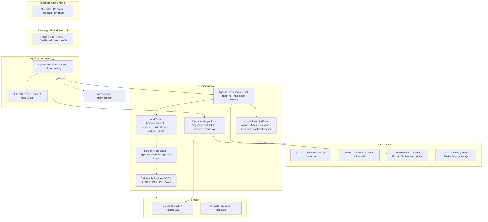

# Sovereign AI Workbench

**On-Premise Agentic AI for Confidential Industrial Work**

A self-hosted, network-isolated workbench for industrial document analysis, RAG,
agentic workflows, and evidence-grounded deliverable generation. All inference,
embeddings, OCR, and code execution run locally on open-weight models — no cloud
API, no external telemetry, no data leaves the machine.

> **Honest terminology.** "Air-gapped" is not claimed. The workbench ships an
> **application-layer egress guard** (outbound HTTP/DNS from the Node process is
> denied and audited). A true air gap additionally requires OS/network-layer
> firewall controls and physical network isolation. See
> [docs/security.md](docs/security.md).

---

## Architecture



---

## Features

| Layer | Description |
|-------|-------------|
| **Sovereign UI** | React + Vite dashboard with RBAC, document uploads, workbench, audit viewer, monitoring |
| **Secure API** | Express 5, JWT auth, role-based access control, input validation, rate limiting, fail-fast secret checks |
| **Document Ingestion** | PDF / DOCX / XLSX / image upload, magic-byte validation, deduplication, versioning, supersede tracking |
| **Agentic Orchestrator** | Task classification, risk gating, model selection, tool routing, multi-step execution with approval gates |
| **Local Multimodal AI** | OCR (Tesseract + local pdf.js rasterizer), Vision (Qwen3-VL), Embeddings (Nomic), LLM (Ollama) — all local |
| **Local Tools** | File I/O, spreadsheet processing (via xlsx), calculations, sandboxed code execution |
| **Sovereign RAG** | Hybrid BM25 + cosine retrieval with MMR diversification, per-document diversity caps, relevance threshold |
| **Evidence-Grounded Results** | Verified facts, AI observations, uncertainty flags, source citations, honest refusal |
| **Human-in-the-Loop** | Approval gates for high- and medium-risk tasks — review, approve, reject |
| **Deliverable Engine** | Content-addressed DOCX / PDF / XLSX / PPTX / code artifact generation |
| **Audit & Governance** | SHA-256 tamper-evident audit chain, backup, retention, integrity checks |
| **Security Plane** | Application-layer egress guard, RBAC, Docker sandbox (`--network none`), secrets management |

---

## Quick Start

### Prerequisites

- **Node.js** ≥ 18
- **Ollama** (optional; required for local LLM/vision/embedding inference) — https://ollama.com
- **Docker** (optional; required for sandboxed code execution)

### Install & Run

```bash
# Install dependencies
npm install
cd frontend && npm install && cd ..

# Configure environment
cp .env.example .env
# Edit .env — at minimum set a strong JWT_SECRET (and SOVEREIGN_JWT_SECRET for
# the sovereign domain). The server refuses to boot with a weak or missing secret.

# Ingest the sample knowledge base
npm run seed

# Start the server
npm start
# → http://localhost:5000
```

### Local Model Gateway

Pull models into Ollama for full AI capabilities:

```bash
ollama pull qwen3:8b
ollama pull qwen3-vl:8b
ollama pull nomic-embed-text
```

Set `LOCAL_GATEWAY_BASE=http://127.0.0.1:11434` in `.env`. The model registry
routers across `reasoning_local`, `coding_local`, `vision_local` and
`embedding_embed` slots with hardware-profile-aware defaults and admin overrides.

---

## Available Scripts

| Command | Description |
|---------|-------------|
| `npm start` | Start the server (default `http://localhost:5000`) |
| `npm run seed` | Ingest the sample SOP / policy / LOTO knowledge base |
| `npm run demo` | Deterministic end-to-end example run |
| `npm run demo:flagship` | Flagship example: scanned report → approval → deliverable |
| `npm run assets` | Regenerate simulated dataset files |
| `npm run excel` | Excel/telemetry analysis workflow |
| `npm run eval` | Offline self-check suite (26 checks) |
| `npm test` | Unit / integration suite (48 tests) |
| `npm run test:tools` | Tool smoke tests (live LLM optional via `TESTS_LIVE_LLM=1`) |
| `npm run test:scanned` | Scanned PDF → local OCR → RAG → grounded answer E2E |
| `npm run test:security` | Prompt injection, unauthorized approval, bypass tests |
| `npm run test:egress` | Egress guard verification |
| `npm run test:auth` | Authentication suite (21 tests) |
| `npm run test:hardening` | Hardening suite (53 tests) |
| `npm run test:docker` | Docker sandbox integration |

---

## Project Structure

```
├── backend/
│   ├── agents/          # Orchestrator, task router, workflows
│   ├── artifacts/       # Artifact generation (DOCX, PDF, XLSX, PPTX)
│   ├── config/          # App config, sovereign config, fail-fast secret checks
│   ├── controllers/     # Auth, sovereign, document, analytics, eval, AI features
│   ├── middleware/      # Auth middleware, RBAC, rate limiting, errors
│   ├── models/          # Model registry, classifier, router, capabilities
│   ├── monitor/         # System monitoring + egress guard
│   ├── ocr/             # OCR service, PDF rasterizer
│   ├── providers/       # Local (and optional cloud) AI providers
│   ├── rag/             # Chunker, sovereign pipeline, fallback embedder, vector store
│   ├── sandbox/         # Docker sandbox, static code guard
│   ├── security/        # Audit chain, RBAC, policy, sovereign auth
│   ├── services/        # Agent, AI, retrieval, artifact, mail, STT/TTS, etc.
│   ├── storage/         # Sovereign SQLite DB
│   ├── tools/           # Tool registry + implementations
│   └── vision/          # Vision service
├── frontend/
│   └── src/
│       ├── components/  # 3D scenes, auth, layout, sovereign shell
│       ├── context/     # Auth & sovereign auth context
│       ├── pages/       # Workbench, agent, documents, approvals, audit, models, tools, users, monitoring…
│       └── services/    # API & auth services
├── datasets/            # Simulated sample inputs (clearly labelled)
├── docs/                # Architecture, security, deployment, API, model cards
├── evaluation/          # Test suites, eval runners
├── infrastructure/      # Docker, nginx, off-line bundling
├── scripts/             # Seed, example runs, asset generation
├── sovereign/           # Runtime data, audit logs, backups, artifacts (git-ignored)
└── server.js            # Express entry point
```

---

## Workbench Pages

| Route | Description |
|-------|-------------|
| `/workbench` | Dashboard: status, models, collections, documents, live telemetry |
| `/workbench/agent` | Agentic task composer with approval gate, packet and trace |
| `/workbench/documents` | Upload + ingest documents, PDF/OCR pipelines |
| `/workbench/data-analysis` | CSV/telemetry analytics with statistical outlier detection |
| `/workbench/deliverables` | Generated artifacts (DOCX / XLSX / PPTX / PDF) |
| `/workbench/vision` | Local vision / OCR analysis |
| `/workbench/coding` | Sandboxed code assistant |
| `/workbench/approvals` | Human-in-the-loop approval gates |
| `/workbench/audit` | Verified SHA-256 hash-chain audit log |
| `/workbench/sovereignty` | Sovereignty center: egress, network, model locality |
| `/workbench/security` | Security policies, RBAC, secret posture |
| `/workbench/models` | Model registry & health (including the verification panel) |
| `/workbench/tools` | Tool manager (admin) |
| `/workbench/users` | Users & roles (admin) |
| `/workbench/monitoring` | System verification / health checks |
| `/workbench/settings` | System configuration |

---

## Sovereignty & Security

- **Local-only execution** — all AI inference runs on the local gateway; no cloud
  API calls in sovereign mode.
- **Egress guard** — outbound `fetch`/`http`/`https`/DNS from the Node process is
  denied and logged in `deny` mode (`SOVEREIGN_EGRESS=deny`).
- **Fail-fast secrets** — the server refuses to boot without a strong JWT secret
  and rejects any known development placeholder in production.
- **RBAC** — role-based access control (Admin, Manager, Engineer, Inspector) with
  resource ownership and tool permission gates.
- **Sandboxing** — code executes in Docker with `--network none`, memory/CPU caps;
  honest refusal when Docker is absent (never falls back to a cloud runner).
- **Audit trail** — SHA-256 tamper-evident hash chain: user, action, timestamp,
  artifact hash; integrity verified on demand.
- **Backup & retention** — WAL-safe `VACUUM INTO` backups with configurable retention.

See [docs/security.md](docs/security.md) for the full threat model and controls.

---

## Tech Stack

| Component | Technology |
|-----------|------------|
| Frontend | React 19, Vite, React Router, Three.js (3D scenes) |
| Backend | Express 5, Node.js, JWT, Passport |
| Database | SQLite (sovereign default) / PostgreSQL (optional) |
| AI Models | Ollama (Qwen3 family, Qwen3-VL, Nomic Embed) |
| OCR | Tesseract, pdfjs-dist |
| RAG | Hybrid BM25 + cosine similarity + MMR |
| Document Generation | docx, pdf-lib, pptxgenjs, xlsx |
| Security | bcrypt, rate limiting, RBAC, SHA-256 audit chain |

---

## Documentation

| Document | Description |
|----------|-------------|
| [Architecture](docs/architecture.md) | System design & component overview |
| [Security Model](docs/security.md) | Threat model & security controls |
| [Deployment](docs/deployment.md) | On-premise deployment guide |
| [API Reference](docs/api.md) | Sovereign API endpoints |
| [Database Schema](docs/db-schema.md) | Table definitions & relationships |
| [Model Cards](docs/model-cards.md) | Model stack specifications |
| [Limitations](docs/limitations.md) | Risk register & known limitations |
| [Test Report](docs/test-report.md) | Live suite results |
| [Contributing](CONTRIBUTING.md) | How to contribute |

---

## Datasets

The `datasets/` folder holds **simulated** sample inputs for demonstration only:

- `pump-p101-inspection-report.txt` — Simulated inspection report
- `pump-p101-scanned-tag.png` — Simulated scanned equipment tag
- `telemetry_B101_vibration.csv` — Simulated vibration telemetry data

> All dataset files are clearly labelled **SIMULATED / DEMO ONLY**. They do not
> describe any real plant, equipment, person, reading or incident. See
> `datasets/README.md`.

---

## License

ISC